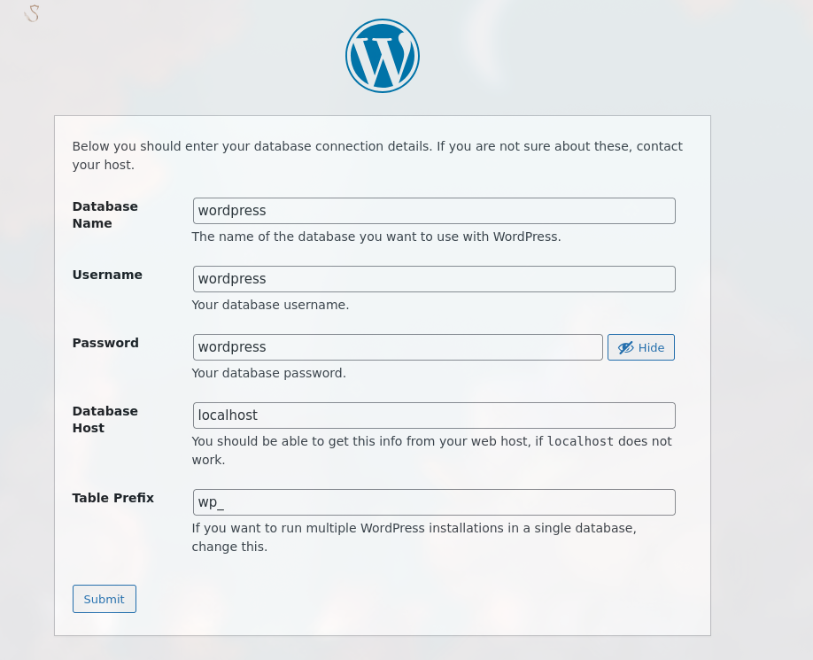
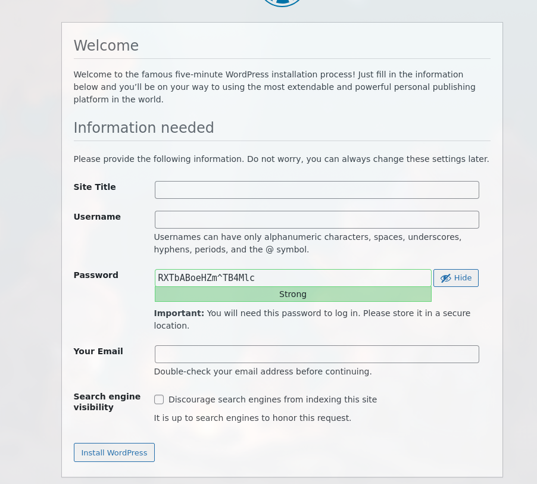

# Лабораторная работа №5: Запуск сайта в контейнере

## Студент: Кроитор Александр

## Группа: IA2403

## Преподаватель: M. Croitor

## Дата: 17-02-2026

## Цель работы: Выполнив данную работу студент сможет подготовить образ контейнера для запуска веб-сайта на базе Apache HTTP Server + PHP (mod_php) + MariaDB.

## Задание: Создать Dockerfile для сборки образа контейнера, который будет содержать веб-сайт на базе Apache HTTP Server + PHP (mod_php) + MariaDB. База данных MariaDB должна храниться в монтируемом томе. Сервер должен быть доступен по порту 8000.

Докер (podman) установлен

```bash
-> podman -v
podman version 5.7.0
```

#### Дерево проекта:

```bash
tree
└── .
    ├── README.md
    ├── Dockerfile
    └── files/
        ├── apache2
        ├── mariadb
        └── php
```

```dockerfile
FROM debian:latest

RUN apt-get update && \
    apt-get install -y apache2 php libapache2-mod-php php-mysql mariadb-server && \
    apt-get clean

```

Билдим докер контейнер:

```bash
podman build -t apache2-php-mariadb .
```

После успешной сборки мы подключаемся через localhost

```bash
podman run -d --name apache2-php-mariadb apache2-php-mariadb tail -f /dev/null
```

-d отвечает за фоновую работу, а tail -f держит контейнер рабочим, так как tail читает файл, а из-за -f в реальном времени, а так как файл /dev/null, то это ничего не нагружает, в сути пока у нас нет центрального процесса (позже этим будет supervisord), это костыль для поддержания жизни контейнера

Копируем файлы из контейнера прямо к нам в папку

```bash
podman cp apache2-php-mariadb:/etc/apache2/sites-available/000-default.conf files/apache2/
podman cp apache2-php-mariadb:/etc/apache2/apache2.conf files/apache2/
podman cp apache2-php-mariadb:/etc/mysql/mariadb.conf.d/50-server.cnf files/mariadb/
```

но комманда

```bash
podman cp apache2-php-mariadb:/etc/php/8.2/apache2/php.ini files/php/
```

Не работает, потому что LATEST версия debian LTS обновилась и теперь актуальная LTS версия php это php 8.4

Вот доказательства

```bash
root@61c8159b002a:/# ls /etc/php/8.4/apache2/php.ini
/etc/php/8.4/apache2/php.ini
```

Соответственно комманда будет принимать вид:

```bash
podman cp apache2-php-mariadb:/etc/php/8.4/apache2/php.ini files/php/
```

Теперь дерево проекта выглядит следующим образом:

```bash
tree
└── .
    ├── Dockerfile
    ├── README.md
    └── files/
        ├── apache2/
        │   ├── 000-default.conf
        │   └── apache2.conf
        ├── mariadb/
        │   └── 50-server.cnf
        └── php/
            └── php.ini
```

Переходим в  000-default.conf через nvim

```conf
	ServerAdmin kroitorsasha06@gmail.com

	DocumentRoot /var/www/html
    DirectoryIndex index.php index.html
```

#### Всякое

DirectoryIndex отвечает за то какой файл открывать автоматически при обращении к каталогу, сначала идёт index.php, если его нет, то берётся index.html
Добавляем заялвенные необходимые строки
про них я говорил в прошлых лабораторных работах

В конце apache.conf добавляем название сервера

```conf
echo "ServerName localhost" >> apache2.conf
```

в php.ini заменяем
;error_log = php_errors.log -> error_log = /var/log/php_errors.log

Указываем значения по лимиту оперативной памяти, максимальный размер файла загружаемого через php, максимальный общий размер данных и максимальное время выполнения одного скрипта:

```conf
memory_limit = 128M
upload_max_filesize = 128M
post_max_size = 128M
max_execution_time = 120
```

Раскомментируем строку #log_error = /var/log/mysql/error.log в files/mariadb/50-server.cnf

Добавляем файл в структуру проекта

```bash
tree
└── .
    ├── Dockerfile
    ├── README.md
    └── files/
        ├── apache2/
        │   ├── 000-default.conf
        │   └── apache2.conf
        ├── mariadb/
        │   └── 50-server.cnf
        ├── php/
        │   └── php.ini
        └── supervisor/
            └── supervisord.conf
cat files/supervisor/supervisord.conf
[supervisord]
nodaemon=true
logfile=/dev/null
user=root

# apache2
[program:apache2]
command=/usr/sbin/apache2ctl -D FOREGROUND
autostart=true
autorestart=true
startretries=3
stderr_logfile=/proc/self/fd/2
user=root

# mariadb
[program:mariadb]
command=/usr/sbin/mariadbd --user=mysql
autostart=true
autorestart=true
startretries=3
stderr_logfile=/proc/self/fd/2
user=mysql
```

#### Докерфайл

Добавляем монтирование ключевым словом VOLUME монтирование томов

```dockerfile
# mount volume for mysql data
VOLUME /var/lib/mysql

# mount volume for logs
VOLUME /var/log
```

Добавляем в инструкцию RUN скачивание пакета supervisor и копирование и распаковку сайта WordPress после RUN

```dockerfile
RUN apt-get update && \
    apt-get install -y apache2 php libapache2-mod-php php-mysql mariadb-server supervisor && \
    apt-get clean

ADD https://wordpress.org/latest.tar.gz /tmp/

RUN tar -xzf /tmp/latest.tar.gz -C /var/www/html --strip-components=1 && \
    rm /tmp/latest.tar.gz
```

--strip-components отвечает за то сколько родительских слоёв будет пропущено, в данном случае мы пропускаем папку wordpress
-C отвечает за Change Directory

Добавляем копирование конфигурационных файлов apache2 php mariadb и скрипт запуска

```dockerfile
# copy the configuration file for apache2 from files/ directory
COPY files/apache2/000-default.conf /etc/apache2/sites-available/000-default.conf
COPY files/apache2/apache2.conf /etc/apache2/apache2.conf

# copy the configuration file for php from files/ directory
COPY files/php/php.ini /etc/php/8.2/apache2/php.ini

# copy the configuration file for mysql from files/ directory
COPY files/mariadb/50-server.cnf /etc/mysql/mariadb.conf.d/50-server.cnf

# copy the supervisor configuration file
COPY files/supervisor/supervisord.conf /etc/supervisor/supervisord.conf

# Права доступа через chown добавляем
RUN mkdir /var/run/mysqld && chown mysql:mysql /var/run/mysqld

# Открываем порт 80 (вернее мы его так не открываем, а скорее семантически пишем, что мы собираемся его открыть)
EXPOSE 80

# команда автозапуска
CMD ["/usr/bin/supervisord", "-n", "-c", "/etc/supervisor/conf.d/supervisord.conf"]
```

Собираем вновь образ контейнера

```bash
podman build -t apache2-php-mariadb .
```

запуск

```bash
podman run -d --name apache2-php-mariadb -p 8000:80 apache2-php-mariadb
```

Сайт wordpress установился корректно

```bash
root@b797f65402bb:/# ls /var/www/html/
index.html   wp-activate.php	  wp-config-sample.php  wp-links-opml.php  wp-settings.php
index.php    wp-admin		  wp-content		wp-load.php	   wp-signup.php
license.txt  wp-blog-header.php    wp-cron.php		wp-login.php	   wp-trackback.php
readme.html  wp-comments-post.php  wp-includes		wp-mail.php	   xmlrpc.php
root@b797f65402bb:/#
```

Конфигурация apache2 так же изменилась

```bash
root@b797f65402bb:/# tail -1 /etc/apache2/apache2.conf
ServerName localhost
```

Подключаемся к базе данных

```bash
podman exec -it apache2-php-mariadb bash
root@6f7af2043835:/# mysql
Welcome to the MariaDB monitor.  Commands end with ; or \g.
Your MariaDB connection id is 3
Server version: 11.8.3-MariaDB-0+deb13u1 from Debian -- Please help get to 10k stars at https://github.com/MariaDB/Server

Copyright (c) 2000, 2018, Oracle, MariaDB Corporation Ab and others.

Type 'help;' or '\h' for help. Type '\c' to clear the current input statement.

MariaDB [(none)]>
```

Создаём базу данных

```mysql
CREATE DATABASE wordpress;
CREATE USER 'wordpress'@'localhost' IDENTIFIED BY 'wordpress';
GRANT ALL PRIVILEGES ON wordpress.* TO 'wordpress'@'localhost';
FLUSH PRIVILEGES;
EXIT;
```

Успех

```mysql
Query OK, 1 row affected (0.001 sec)

Query OK, 0 rows affected (0.005 sec)

Query OK, 0 rows affected (0.002 sec)

Query OK, 0 rows affected (0.001 sec)

Bye
```

Заполняем параметры подключения к базе данных


Копируем содержимое файла конфигурации в ./files/wp-config.php

Добавляем автоматическое копирование к докер

```dockerfile
COPY files/wp-config.php /var/www/html/wp-config.php
```

И пересобираем контейнер

```bash
podman rm -f apache2-php-mariadb
podman build -t apache2-php-mariadb
podman run -d --name apache2-php-mariadb -p 8000:80 apache2-php-mariadb
podman exec -it apache2-php-mariadb bash
```

Сайт работоспособен


#### Ответы на вопросы:

Q: Какие файлы конфигурации были изменены?
A:

- 000-default.conf
- apache2.conf
- php.ini
- 50-server.cnf

Q: За что отвечает инструкция DirectoryIndex в файле конфигурации apache2?
A: DirectoryIndex отвечает за то какой файл открывать автоматически при обращении к каталогу, сначала идёт index.php, если его нет, то берётся index.html

Q: Зачем нужен файл wp-config.php?
A: Это конфигурационный файл WordPress, в нём хранятся параметры соеденения с базой данных (Mysql/mariadb), настройки безопасности

Q: За что отвечает параметр post_max_size в файле конфигурации php?
A: Максимальный размер файлов отправленных путём **POST** запроса

Q: Укажите, на ваш взгляд, какие недостатки есть в созданном образе контейнера?
A: Основным недостатком является монолитность, вся конфигурация apache2, mariadb, php запущены в одном контейнере, лучшей
практикой было бы разделить на несколько контейнеров по области ответственности, использование latest грозит отсутствием
фиксированной версии и возможными проблемами с API взаимодействия, версией пакетов, совместимостью в будущем, так же
нецелосообразное использование полного образа debian вместо **slim** версии. Ну и безопасность, открытые порты, mariadb без пароля, все сервисы в одном контейнере

#### Выводы:

- Докер самостоятельно неплохо решает проблему поднятия и фиксирования сервисов.

#### Библиография

```bash
podman --help
```
